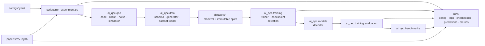

# AI-QEC 当前架构

本文描述仓库**当前的可执行架构**及工作区放置规则，不把研究愿景或预留目录写成已经提供的能力。外部工具与 backend 选型见 [TECHNOLOGY_STACK.md](TECHNOLOGY_STACK.md)；研究方向见 [RESEARCH_TOPICS.md](RESEARCH_TOPICS.md)，待办任务和验收条件见 [OPTIMIZATION_PLAN.md](OPTIMIZATION_PLAN.md)。

## 1. 设计边界

项目把五种对象严格分开：

| 对象 | 唯一位置 | 说明 |
|---|---|---|
| 可复用 Python 实现 | `ai_qec/` | QEC、数据、模型、训练、评估和基础设施 |
| 实验声明 | `configs/` | 参数、能力选择和 flow；不写运行结果 |
| 可复用数据集 | `datasets/` | 内容寻址、带 manifest、可被多个 run 引用 |
| 一次执行的结果 | `runs/<run_id>/` | 配置快照、日志、checkpoint、预测、指标和报告 |
| 论文材料与入口 | `paper/docs/`、`paper/srcs/` | PDF 与每篇论文一个 Notebook；不实现算法 |

`scripts/` 是命令入口和流程编排层。它可以解析命令参数、调用 runner 和导出器；QEC 物理、数据 schema、模型、训练和 benchmark 逻辑必须位于 `ai_qec/`。`tests/` 只验证代码，不保存实验数据或结果。

### 工作区的 Git 与写入边界

| 目录 | Git | 写入者 |
|---|---|---|
| `ai_qec/`、`configs/`、`scripts/`、`tests/`、`docs/` | 跟踪 | 开发者 |
| `paper/docs/`、`paper/srcs/`、`paper/templates/` | 跟踪 | 开发者 |
| `paper/releases/` | 忽略 | 显式 allowlist 导出器 |
| `datasets/` | 忽略 | 数据生成器 |
| `runs/` | 忽略 | 实验 runner |

`.git/`、`.codex/`、`.agents/` 和 `.vscode/` 是本地工具状态，不属于项目功能。根目录的 `README.md`、`AGENTS.md`、`pyproject.toml`、`requirements.txt`、`.gitignore` 和 `.gitattributes` 分别负责项目入口、Agent 规则、打包、依赖和仓库策略。

## 2. 当前执行数据流



同一配置再次生成数据时，数据生成器先检查 `datasets/` 中对应的 manifest、hash、schema 和样本数。只有完全匹配且非空的数据集可以复用。每次 runner 执行都创建新的 `runs/<run_id>/`，不会覆盖已完成 run。

## 3. `ai_qec/` 模块职责与状态

状态含义：

- **可执行**：已有配置和入口会调用该模块。
- **基础接口**：提供数据结构或边界，尚未形成独立实验能力。
- **路线图**：目录用于组织后续方向；未实现入口必须失败，不得伪造成功结果。

| 模块 | 职责 | 当前状态 |
|---|---|---|
| `qec/` | code、circuit、noise、detector 和 simulator 的定义与注册 | 可执行：toy 路径与 Toric code-capacity 路径 |
| `data/` | dataset schema、生成、加载、预处理、采样和 split | 可执行：数据生成器只写入 `datasets/`，并校验 manifest |
| `models/` | decoder、经典参考解码器、head、adapter 与公共层 | 可执行路径包含线性基线、PyTorch 联合 RBM、单链/并行 Gibbs 与项目 DecodeRequest/DecodeResult 契约；其余模型目录是扩展边界 |
| `training/` | trainer、目标函数、优化、checkpoint、训练期评估 | 可执行路径包含 ridge 与 PyTorch RBM CD-k 训练；其他训练能力按配置显式限制 |
| `benchmarks/` | 解码、准确率、鲁棒性、迁移和延迟的评价协议 | 可执行路径包含 toy benchmark 与 Toric logical-failure 对照；其余为扩展边界 |
| `utils/` | 配置校验、路径解析、序列化、随机种子与可复现性 | 可执行基础设施 |
| `adaptation/` | 噪声估计、弱因素学习、迁移与持续学习 | 路线图 |
| `runtime/` | circuit/detector context、Pauli frame、FTQC 状态 | 路线图 |
| `deployment/` | profiling、压缩、硬件后端、实时反馈 | 路线图 |
| `design/` | code、encoder、decoder、syndrome 与 protocol 搜索 | 路线图 |

### `qec/`

```text
qec/
├── codes/        码的几何、边/比特编号、syndrome 与逻辑语义
├── circuits/     memory 或 code-capacity 等实验电路描述
├── noise/        噪声参数与采样模型
├── detectors/    detector/syndrome 表示和图结构边界
└── simulators/   依据 code、circuit、noise 生成物理样本的后端
```

该层只描述或采样 QEC 问题，不读取 checkpoint、不执行训练循环，也不写 run 文件。

### `data/`

```text
data/
├── schema/         样本、上下文和 manifest 契约
├── generators/     code + circuit + noise + backend → immutable dataset
├── datasets/       split 加载、schema/hash/物理一致性校验
├── preprocessing/  tensor、graph、token 等可重建数据视图
├── sampling/       balanced、importance、hard-example 等采样策略边界
└── splits/         train / validation / test 划分规则
```

`ai_qec/data/` 是数据**代码**；`datasets/` 是实际的二进制数据和 manifest，两者不能混用。

### `models/`

```text
models/
├── decoders/        学习型和经典参考解码器
├── heads/           分类、回归和多任务输出头
├── adapters/        模型适配器边界
├── noise_encoders/  syndrome 到噪声表征的边界
├── layers/          可复用网络层
└── registry.py      配置到已注册模型的构建入口
```

模型接收已定义的数据表示并产生预测或恢复链；它不负责生成数据集、执行 epoch 循环或选择 run 目录。

### `training/`

```text
training/
├── trainers/        训练循环和 checkpoint 选择
├── objectives/      训练目标
├── optimizers/      优化器构建
├── schedulers/      学习率调度边界
├── callbacks/       日志、early stopping、checkpoint 回调
├── evaluation/      checkpoint 与指定 split 的评估
├── curriculum/      课程学习边界
├── hard_mining/     困难样本挖掘边界
└── regularization/  正则化边界
```

训练器读取已验证的数据集，向当前 run 的 `checkpoints/`、`predictions/` 和指标文件写入结果。它不定义 QEC 几何或命令行参数。

### `benchmarks/`

`benchmarks/` 对同一预测和同一测试 split 计算可比较的结果，例如逻辑失败率、准确率、鲁棒性或延迟。benchmark 读取预测和真值，不重新训练模型。论文 RBM 路径在此层比较 syndrome-clamped Gibbs 解码与小规模精确 MWPM，并将 timeout 显式记录。

### 路线图模块

`adaptation/`、`runtime/`、`deployment/` 与 `design/` 保留研究方向的模块边界。它们不是当前实验管线的隐式依赖；使用未实现能力必须在启动前或调用时明确失败。具体交付顺序以优化计划为准。

## 4. 配置、数据和 run 的关系

```text
config
  ├── 可选定义 execution.conda_env，以及 qec / noise / data / model / training
  ├── 定义 flow 与每个步骤的输出契约
  └── 经严格校验后成为 resolved plan

resolved plan
  ├── 生成或校验 datasets/<id>-<hash>/
  └── 创建 runs/<run_id>/ 并执行 flow

run manifest
  ├── 绑定 config hash、git 状态、目标解释器环境和 dataset reference
  ├── 记录每个步骤的命令、日志、状态和产物 hash
  └── 记录 success、partial、failed 或 interrupted 终态
```

数据集必须包含非空样本、数组 schema、特征信息和 provenance manifest。checkpoint 与评估器必须校验模型实现、数据身份和代码版本，避免把不同 run 的数据、模型和指标拼接为一个结果。

`execution.conda_env` 是可选的 Conda 环境名。存在时 runner 在写入 run 前解析该环境的 Python，并以该环境执行完整 flow；manifest 和 `environment.json` 从目标解释器采集版本信息。未指定时使用启动 runner 的解释器。

### 产物位置与放置规则

```text
configs/<experiment>.yaml                  # 参数与 flow
datasets/<dataset-id>-<hash>/              # 不可变 split 与 dataset_manifest.json
runs/<run_id>/
├── config.yaml                            # 当次配置快照
├── resolved_plan.json
├── run_manifest.json
├── environment.json
├── logs/
├── checkpoints/
├── predictions/
├── figures/
├── metrics.json
└── benchmark_report.json
```

checkpoint、预测、图表和指标归属产生它们的 run。可审阅的参数和 flow 放入 `configs/`，可复用的 Python 逻辑放入 `ai_qec/`；`scripts/` 只处理命令参数和编排。数据生成器只写入真实、非空且 schema 兼容的 dataset，runner 只写入新建 run，不覆盖旧结果。不要另建顶层 `artifacts/`、`checkpoints/`、`data/`、`models/` 或 `vendors/`；这些对象已经有明确归属。

## 5. 论文复现边界

每篇论文在 `paper/` 中只保留 PDF 和实验 Notebook 两类源材料；复现模板和生成的 release 单独存放：

```text
paper/docs/<paper>.pdf
paper/srcs/<paper-id>.ipynb
paper/templates/                     # 最小复现包模板
paper/releases/                      # 本地不可变导出包；Git 忽略
```

`paper/docs/` 只保存论文 PDF 与补充材料；`paper/releases/` 只由显式 allowlist 导出器创建。Notebook 的职责是选择配置、触发 runner、读取 manifest/metrics/predictions 并展示结果。它不能在单元格中重新定义 code、数据生成、模型、训练循环、解码器或指标。Torlai–Melko 的 code、采样、RBM、Gibbs、MWPM 和 benchmark 均归 `ai_qec/`，Notebook 只组织 run 和展示结果。论文特有的实现归属和引用见 [PAPER_REPRODUCTION_DESIGN.md](PAPER_REPRODUCTION_DESIGN.md)。

## 6. 架构与规划一致性核对（2026-09-15）

**判断：目录与执行边界基本一致，能力交付尚未达到目标技术栈和后续 Phase 的验收范围。** 当前代码按 `ai_qec/`、`configs/`、`scripts/`、`datasets/`、`runs/` 和 `paper/` 分工；runner 创建独立 run，保存配置快照、resolved plan、环境、日志、步骤状态与产物记录。toy synthetic 和 Toric code-capacity RBM 是两条不同的已实现 smoke 路径；它们的结果不能替代计划中的 Stim surface-code memory、D2.2 科研基准或电路级神经解码器结果。

| 核对项 | 当前证据与偏差 | 对应规划 |
|---|---|---|
| 代码与产物分层 | `scripts/run_experiment.py` 编排已解析的 flow，领域代码主要位于 `ai_qec/`；数据集与 run 分别保存。与本文件的工作区边界基本一致。 | 当前架构与目录规划 |
| 可执行能力 | `toy_synthetic`、`toric_code_capacity` 和线性/RBM 路径已接入；配置拒绝未实现的 `stim` 和 `transformer_decoder`。Stim circuit/DEM、raw detector events schema v2、Sinter、电路级神经模型仍未接入。 | P1.2–P1.9、P3.2–P3.7 |
| 经典 decoder | 小规模 Toric 精确 MWPM 可执行；PyMatching Toric adapter 有代码，但本次默认解释器未安装 `pymatching`，对应可选测试被跳过。Stim DEM 版 MWPM 仍待实现。 | P1.5、P1.9 |
| 预留模块的成功语义 | `design/code_search/search.py` 的 `candidate_codes()` 返回固定码名；`adaptation/continual_learning/continual.py` 的 `update_stream_state()` 只更新 batch ID。这些是辅助/占位操作，不能作为 code search 或 continual learning 已实现的证据；若作为相应能力入口，应明确拒绝或改成真实实现。 | P0.3 的 fail-loudly 约束、P5 扩展 |
| 计划状态文档 | `OPTIMIZATION_PLAN.md` 第 1 节保留 P0 修复前的旧仓库基线：runner smoke 未覆盖、`stim` 静默回退、run ID 碰撞等。该节现已标明历史日期；当前状态以本文件、配置校验、runner 和 `tests/smoke/test_pipeline.py` 为准。 | 计划第 1 节与 P0 已勾选任务 |
| 正式验收 | 核对时工作树有未提交改动；本次检查不能作为要求 clean worktree 的正式实验验收。 | 执行约定与各 Phase Exit Criteria |

本次验证运行 `python3 -m unittest discover -s tests -t .`，结果为 15 个测试通过、1 个跳过；`python3 scripts/run_experiment.py --config configs/experiment.smoke.yaml --project-root . --dry-run` 成功解析四步 toy flow。dry-run 不执行生成、训练或评估；上述结果只支持当前代码路径与运行契约的核对，不证明未接入能力或科研指标。下一步按 P1 → P2 → P3 的门槛交付真实电路级纵切面，并处理占位函数的能力语义。

## 7. 文档维护规则

| 文档 | 只维护的内容 |
|---|---|
| [README.md](../README.md) | 项目入口、安装和最短执行命令 |
| [TECHNOLOGY_STACK.md](TECHNOLOGY_STACK.md) | 外部依赖、标准格式、backend 与模型技术选型 |
| 本文 | 当前代码分层、模块边界、数据流、能力状态和工作区放置规则 |
| [RESEARCH_TOPICS.md](RESEARCH_TOPICS.md) | D1–D5 研究问题与术语 |
| [OPTIMIZATION_PLAN.md](OPTIMIZATION_PLAN.md) | 任务、依赖、验收条件和未完成路线图 |
| [PAPER_REPRODUCTION_DESIGN.md](PAPER_REPRODUCTION_DESIGN.md) | 论文复现的范围、代码映射与 Notebook 规则 |

新增能力时，同时更新本文的模块状态、对应配置说明和测试；新增研究方向时更新研究主题地图和优化计划。不要在多个文档复制同一份完整目录树。
