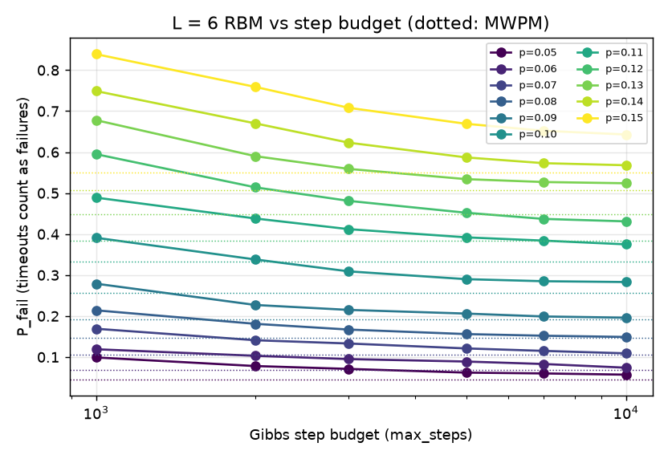

# Torlai & Melko (2017) RBM 神经解码器复现报告

> 论文：G. Torlai and R. G. Melko, “Neural Decoder for Topological Codes,” *Phys. Rev. Lett.* **119**, 030501 (2017), [doi:10.1103/PhysRevLett.119.030501](https://doi.org/10.1103/PhysRevLett.119.030501)。
> 本报告是项目内的独立复现（project-local），不使用作者源码。结果数据与全部 run ID 见 [`assets/torlai_melko_2017/results_summary.json`](assets/torlai_melko_2017/results_summary.json)；实现与调用关系见 [论文复现设计](PAPER_REPRODUCTION_DESIGN.md)。

## 结论摘要

- **复现了论文的解码方法和图 3、图 4 的主要趋势。** L=4 在 p ≤ 0.13 的 9 个错误率上与论文读数相差约 0.02 以内；阈值以下 RBM 与 MWPM 的失败率在置信区间内一致，阈值以上 RBM 变差，与论文描述方向相同，但 p=0.14、0.15 的失败率比论文读数高 0.03–0.05。图 4 的同调类分布在 4 个错误率下与论文基本一致。
- **L=6 需要更大的解码截止步数。**（这不是与论文 10² 的矛盾：论文的 10² 是预热步数，截止上限论文未给出。） 以 1000 步为上限时，超时占主导，失败率明显高于论文；把上限提高到 10000 步、复用同一模型重新解码后，p ≤ 0.09 的结果与 MWPM 一致，除 p=0.05 略高外也与论文读数一致；p ≥ 0.11 时 RBM 明显差于 MWPM。
- **定量结论仍有限制。** 只训练了一个随机种子；L=6 的步数上限是在看到结果后调整的；论文补充材料中的超参数无法获得，本项目的超参数是自己选定的。
- **RBM 解码的采样分布与真实后验存在明显偏差。** 平均失败率吻合，但在较难的 syndrome 上，重复解码得到的同调类比例与精确后验相差很大。

结论的准确表述是：**复现了论文解码方法及其主要定性趋势；定量性能与采样分布仍在验证。**

## 1. 论文方法与本项目的实验设计

### 1.1 物理问题

论文研究二维 toric code 在**独立相位翻转噪声**下的解码：`L × L` 周期格点的每条边上有一个量子比特，共 `N = 2L²` 个；每个量子比特以概率 `p` 发生 Z 错误，一次**完美**的顶点稳定子测量给出 syndrome `S`。这是 code-capacity 模型，不涉及测量错误和量子线路。

解码器根据 `S` 给出恢复链 `r`，要求 `S(r) = S(e)`。恢复成功与否取决于闭合环 `e ⊕ r` 的同调类：属于平凡类 h₀ 时成功，属于三个非平凡类之一时发生逻辑错误。逻辑失败率 `P_fail` 就是非平凡同调的比例。

### 1.2 论文的解码方法

论文用受限玻尔兹曼机（RBM）学习错误链与 syndrome 的**联合分布** `p(e, S)`：可见层由 `e` 与 `S` 组成，隐层 `h` 与两者全连接，用对比散度（CD）最小化与训练数据分布之间的 KL 散度。每个错误率 `p` 单独训练一个网络。

解码时（论文 Algorithm 1），把 syndrome 单元固定为测得的 `S₀`，从随机状态出发交替采样 `h ~ p(h | e, S₀)` 与 `e ~ p(e | h)`。这是块 Gibbs 采样，一种马尔可夫链蒙特卡洛方法。需要反复采样的原因有两个：`p(e | S₀)` 无法一步直接抽样；RBM 只是近似学到了奇偶约束 `S = He`，大部分样本并不满足约束。一旦出现满足 `S(e) = S₀` 的错误链，就把它作为恢复链；超过步数上限仍未找到，则判为失败。

论文用 L = 4、6，`p = 0.05 … 0.15` 共 11 个错误率，与最小权重完美匹配（MWPM）比较（图 3），并给出 RBM 返回的同调类分布（图 4）。

### 1.3 论文给出的与未给出的信息

论文正文给出了模型结构、训练目标、解码算法、数据规模量级（`|D_p| ∝ 10⁵`）和平衡步数量级（`N_eq ∝ 10²`）。**所有训练超参数都放在补充材料中**，包括隐单元数、学习率、CD 步数、epoch 数和每个错误率的 grid search 结果；仓库中的论文 PDF 不含补充材料，因此下表中的本项目取值均为自行选定，而非论文数值。

| 设置 | 论文 | 本项目 |
|---|---|---|
| 训练样本 | ∝ 10⁵ | 100,000（另有 10,000 条验证集） |
| 测试样本 | 未给出具体数 | 每点全新留出集：L=4 为 2000 条，L=6 为 1000 条 |
| 隐单元数 | grid search（补充材料） | L=4 为 64，L=6 为 256 |
| 训练 | CD，细节见补充材料 | CD-1，SGD，学习率 0.05，weight decay 1e-4，batch 64，50 epoch |
| 模型选择 | 未说明 | 验证集一步重建 BCE 最低的 epoch |
| 解码 | 单链；平衡（equilibration）约 10² 步后开始检查兼容性；超过固定步数判为失败，该上限未给出数值 | 单链；预热 25 步后每步检查；截止上限 L=4 为 400，L=6 为 1000 与 10000 |
| MWPM 对照 | Blossom V | 精确位掩码动态规划；defect 数超过 18 时改用 PyMatching（同为最小权重完美匹配） |
| 统计 | 未给出误差 | Wilson 95% 置信区间 |

本项目额外加入了两个理论参照（仅 L=4 可计算）：枚举全部 2¹⁷ 条兼容链，得到每个 syndrome 下各同调类的精确后验概率，从而算出**精确最大似然解码**（取后验最大的类）与**理想后验采样**（按后验概率随机取类）的失败率。后者对应"严格按后验分布抽样"的解码规则。

### 1.4 前置验证

正式实验前，先确认 toric code 的实现与噪声模型正确：L = 2…6 上量子比特数、稳定子秩（`L² − 1`）、每个顶点接 4 条边、每条边接 2 个顶点、`syndrome(e) = H·e mod 2`、同调映射是线性的且 4 个同调类都可达；L = 3、4 通过穷举确认码距等于 L，L = 5、6 在 800 万条随机闭环中未发现低于 L 的非平凡逻辑算符；噪声的实测翻转率为 0.07996（目标 0.08），比特之间无显著相关。

## 2. 训练与推理中遇到的问题及解决方法

### 2.1 实验本身的问题

**问题一：冒烟配置严重欠拟合。**
最早的冒烟 run 使用 256 个训练样本、16 个隐单元、8 个 epoch，总共只有 32 次梯度更新。结果 24 条测试样本全部超时，一次也没有解出。诊断依据：训练与验证 BCE 几乎相同（0.435 / 0.433），说明不是过拟合；两者都**劣于**"按每个比特的训练集频率预测"的简单基线（0.377），说明模型连单比特边缘分布都没学完；损失在最后一个 epoch 仍在下降。

为排除"隐单元太少"的可能，用 10⁵ 样本、50 epoch 分别训练 16、64、256 个隐单元：验证 BCE 从 0.121 降到 0.0018，单链解码的平凡类比例却都在 78%–80%，已经接近论文的约 80%。结论是**问题在训练量，而不是模型容量**；更多隐单元主要提高找到兼容链的效率（96 次单链解码中，有效次数由 85 升到 93–95）。据此确定正式实验使用 10⁵ 样本、50 epoch。

另一个诊断现象值得记录：L=4 时，即使用**未训练**的模型，256 条并行链也能在 92% 的样本上找到兼容链，与"盲目随机抽样"的理论命中率 95% 相近。也就是说，在 L=4 上"能找到兼容链"并不能证明模型学到了东西；同样的抽样预算下，L=6 靠盲抽成功的概率只有约 3×10⁻⁶，这条退路完全消失。

**问题二：L=6 的解码步数上限不够。**

先区分两个容易混淆的量：论文的 `N_eq ∝ 10²` 是**预热步数**，即开始检查兼容性之前先让链跑多久；本项目的 `max_steps` 是**截止上限**，即最多允许走多少步去碰到兼容链，预热固定为 25 步。论文正文没有给出上限的数值，并明确指出这个截断使算法的计算开销 ill-defined：上限总可以提高，用更多计算换取更好的精度。因此不存在一个"论文的上限"可供对照。

可比的是预热之后实际需要多少步才命中兼容链。下表统计成功解码的样本（步数含 25 步预热）：

| 配置 | 中位数 | p90 | p99 | 最大 | 超时 |
|---|---|---|---|---|---|
| L=4，上限 400，p=0.05 | 26 | 48 | 231 | 381 | 29 |
| L=4，上限 400，p=0.08 | 29 | 97 | 328 | 398 | 36 |
| L=4，上限 400，p=0.15 | 71 | 199 | 326 | 398 | 39 |
| L=6，上限 10000，p=0.05 | 30 | 307 | 4625 | 8464 | 25 |
| L=6，上限 10000，p=0.08 | 97 | 1126 | 6337 | 9006 | 13 |
| L=6，上限 10000，p=0.15 | 1297 | 4759 | 8624 | 9922 | 67 |

- **L=4 的典型步数是 26–71 步，与论文的 10² 同量级**；上限 400 只截断 1.5%–2% 的尾部。
- **差别在尾部，不在典型值。** 命中兼容链近似是"每步以概率 q 成功"的等待问题，所需步数近似几何分布：中位数约 0.7/q，而覆盖 99% 的样本需要约 4.6/q，是中位数的六倍以上。所以上限必须按尾部设定。L=6、p=0.08 的中位数只有 97 步，p99 却是 6337 步，相差 65 倍。
- **q 随码距和错误率迅速下降。** L=4 有 15 个独立奇偶约束，L=6 有 35 个，正好满足全部约束的难度相差 2²⁰ 倍；错误率越高，兼容链在错误链空间中越稀疏。
- 上限 1000 那一组的中位数是**截断后的偏低值**（难解样本都被记为超时），不能直接与 10000 步一组比较。

解决方法：**不重新训练**，复用各点训练好的模型，把上限提高到 10000 步重新解码。由于每条测试样本使用固定的独立随机种子，前 1000 步与原先完全相同，因此一次运行即可得到 1000 到 10000 步各档的结果；每个点都逐条核对了原来已解出的样本完全复现。

需要说明：论文对每个错误率单独做了超参数搜索。模型越准，q 越大，需要的上限越小。本项目所有点共用一组超参数，因此所需上限可能比论文更大；由于补充材料不可得，这一点无法验证。

## 3. 实验结果

### 3.1 逻辑失败率（对应论文图 3）

下图左侧为 L=4，右侧为 L=6。叉号是从论文图 3 读出的数值，读数误差约 ±0.02。L=4 的两条虚线是本项目枚举得到的理论参照。

**L=4**（每点 2000 条测试样本，步数上限 400；失败率中超时算作失败）：

| p | RBM | 95% 区间 | MWPM | 精确最大似然 | 理想后验采样 | 论文约 | 超时 |
|---|---|---|---|---|---|---|---|
| 0.05 | 0.087 | 0.075–0.100 | 0.083 | 0.070 | 0.085 | 0.09 | 29 |
| 0.06 | 0.113 | 0.100–0.128 | 0.114 | 0.091 | 0.123 | 0.11 | 33 |
| 0.07 | 0.150 | 0.135–0.166 | 0.154 | 0.122 | 0.166 | 0.15 | 31 |
| 0.08 | 0.195 | 0.178–0.213 | 0.195 | 0.154 | 0.214 | 0.20 | 36 |
| 0.09 | 0.242 | 0.224–0.261 | 0.234 | 0.189 | 0.263 | 0.24 | 39 |
| 0.10 | 0.300 | 0.280–0.320 | 0.289 | 0.229 | 0.317 | 0.29 | 37 |
| 0.11 | 0.341 | 0.321–0.362 | 0.332 | 0.292 | 0.372 | 0.33 | 55 |
| 0.12 | 0.395 | 0.374–0.417 | 0.390 | 0.316 | 0.429 | 0.39 | 48 |
| 0.13 | 0.453 | 0.431–0.475 | 0.441 | 0.385 | 0.477 | 0.43 | 56 |
| 0.14 | 0.500 | 0.478–0.522 | 0.481 | 0.401 | 0.520 | 0.47 | 65 |
| 0.15 | 0.546 | 0.524–0.568 | 0.500 | 0.445 | 0.554 | 0.50 | 39 |

- p ≤ 0.13 与论文读数相差约 0.02 以内；p=0.14、0.15 分别高出 0.03 和 0.05，即阈值以上 RBM 劣于 MWPM 的幅度比论文读数更大，可能与超参数未按错误率分别调优有关。阈值以下 RBM 与 MWPM 一致；p=0.15 时 RBM 的置信区间已不包含 MWPM 的值。
- 除 p=0.05 外（RBM 0.087，理想后验采样 0.085，差距在误差内），RBM 都**介于精确最大似然与理想后验采样之间**。"取首条兼容链"并不是无偏的后验采样：较早出现的链往往权重更低、更可能属于平凡类，因此表现略好于严格按后验采样。
- 与精确最大似然的差距为 2–10 个百分点，并随错误率增大。这部分差距来自"采样取一个类"的规则本身，模型再好也无法消除；论文提出的多链投票扩展针对的正是这一点。

**L=6**（每点 1000 条测试样本；L=6 无法枚举精确后验）：

| p | RBM（1000 步） | RBM（10000 步） | 95% 区间 | 有效率（10000 步） | MWPM | 论文约 | PyMatching 替补条数 |
|---|---|---|---|---|---|---|---|
| 0.05 | 0.099 | 0.057 | 0.044–0.073 | 97.5% | 0.046 | 0.03 | 0 |
| 0.06 | 0.119 | 0.074 | 0.059–0.092 | 97.2% | 0.069 | 0.06 | 0 |
| 0.07 | 0.169 | 0.109 | 0.091–0.130 | 97.9% | 0.105 | 0.10 | 0 |
| 0.08 | 0.214 | 0.149 | 0.128–0.172 | 98.7% | 0.146 | 0.15 | 0 |
| 0.09 | 0.279 | 0.196 | 0.173–0.222 | 98.9% | 0.192 | 0.20 | 0 |
| 0.10 | 0.391 | 0.283 | 0.256–0.312 | 98.3% | 0.257 | 0.27 | 2 |
| 0.11 | 0.489 | 0.375 | 0.346–0.405 | 98.8% | 0.332 | 0.33 | 6 |
| 0.12 | 0.595 | 0.431 | 0.401–0.462 | 98.4% | 0.384 | 0.39 | 13 |
| 0.13 | 0.678 | 0.524 | 0.493–0.555 | 97.6% | 0.449 | 0.46 | 15 |
| 0.14 | 0.749 | 0.568 | 0.537–0.598 | 95.4% | 0.508 | 0.52 | 26 |
| 0.15 | 0.839 | 0.643 | 0.613–0.672 | 93.3% | 0.551 | 0.56 | 45 |

- 10000 步时，p ≤ 0.09 的 RBM 与 MWPM 相差不超过 0.011；p ≥ 0.11 时 RBM 比 MWPM 差 0.04–0.09，超出统计误差。
- L=4 与 L=6 的 RBM 曲线在 p ≈ 0.10–0.11 处交叉，与论文引用的阈值约 10.9% 相符。
- p=0.05 时 RBM 与 MWPM 都比论文读数（约 0.03）略高，这个点的读图误差相对较大。

失败率随步数上限的变化如下。大部分点在约 5000 步后趋于平缓；p=0.14、0.15 到 10000 步仍有 5%–7% 的样本超时，这两点的 RBM 失败率可能仍略偏高。

### 3.2 同调类分布（对应论文图 4）

论文图 4 给出 RBM 返回的恢复链在四个同调类上的比例（图中未标明码距，按与图 3 数值的一致性判断为 L=4）。下图灰色为论文读数，红色为本项目 RBM（按成功解码的样本统计），橙色为 MWPM。四个错误率下与论文基本一致；p=0.15 时 RBM 的平凡类比例（46%）比论文读数（约 49%）低约 3 个百分点。

### 3.3 采样分布与精确后验的比较

为检验"重复解码的结果是否服从后验分布"，在 L=4、p=0.08 的模型上，对三个 syndrome 各用 500 个不同随机种子重复解码，并与枚举得到的精确后验比较：

- 平凡类后验为 99.9% 的简单 syndrome，500 次全部解到平凡类，步数中位数 26（预热 25 步后立即找到）。
- 后验为 59.8% / 13.9% / 25.2% / 1.2% 的中等 syndrome，RBM 给出 28.4% / 27.7% / 43.7% / 0.2%，3.4% 超时。
- 后验为 34.1% / 34.8% / 9.3% / 21.7% 的困难 syndrome，RBM 给出 5.0% / 19.7% / 11.7% / 63.6%，20% 超时。

单次解码的结果确实是随机的，但**分布与真实后验差异明显**，越难的 syndrome 偏差越大；平均失败率仍能吻合，是因为多数 syndrome 较简单。偏差可能来自模型本身，也可能来自"取首条兼容链"的停止规则，本实验无法区分。这也意味着多链投票扩展能否逼近最大似然，取决于模型分布是否准确，而不只是采样次数。本实验只选了三个 syndrome，每组统计误差约 ±2 个百分点。

### 3.4 计算成本

训练在一个 GPU（RTX 4060 Laptop）上进行。解码是逐样本、逐步的迭代采样，成本随码距和错误率迅速上升：

| 设置 | 每点训练 | 每点解码 | 每条样本解码 |
|---|---|---|---|
| L=4，400 步，2000 条 | 9–12 分钟 | 2.5–7 分钟 | 72–208 ms |
| L=6，1000 步，1000 条 | 5–8 分钟 | 3–17 分钟 | 0.16–1.0 s |
| L=6，10000 步，1000 条 | —（复用模型） | 9–44 分钟 | 0.5–2.6 s |

作为对照，MWPM 每条样本约 0.1 ms。L=6 的耗时是三个进程同时占用 GPU 时测得的，绝对值偏高，但相对比例不受影响。L=6、p=0.15、10000 步时，解码耗时约为训练的 9 倍，少数难以找到兼容链的样本占了大部分时间。

## 4. 局限性

1. **单一训练随机种子。** 置信区间只包含测试抽样误差，不包含训练本身的波动。
2. **L=6 的步数上限是看到结果后调整的。** 报告完整给出了 1000 到 10000 步的曲线，但作为正式数值，最好事先确定上限并在新的测试集上验证。
3. **超参数不是论文的。** 补充材料不可得；所有点使用同一组超参数，没有像论文那样对每个错误率分别搜索。22 个点的验证 BCE 最佳 epoch 都是最后一个（第 50 个），训练尚未完全收敛；隐单元对比实验表明，继续降低 BCE 对解码精度影响很小。
4. **论文数值来自读图**，误差约 ±0.02；图 4 的码距是推断的。
5. **MWPM 的平手处理不同。** 多个等权最优匹配时，精确实现与 PyMatching 可能选择不同的同调类；L=6 上逐条结果一致率为 86%–92%，失败率相差不超过 0.008。
6. **产物哈希问题（P0.19）** 尚未修复；所有 run 都在有未提交改动的工作区中运行，代码状态由各 run 保存的 `git_diff.patch`（含未跟踪文件）记录；已抽查 Notebook 复用验证 run 的 patch，还原结果与提交 `5ec96a8` 的代码完全相同。
7. RBM 已不是当前主流的神经解码方法，本复现的价值主要在于验证方法、建立实验基础设施和积累经验，而非提供有竞争力的解码器。

## 5. 复现方式与数据位置

- **数据与结果**：每个点都是 `runs/` 下独立的 run，包含配置快照、数据集引用、checkpoint、逐样本预测和 benchmark 报告；run ID 列在 [`results_summary.json`](assets/torlai_melko_2017/results_summary.json) 中。`runs/` 与 `datasets/` 不纳入版本控制。
- **单点实验**：[`paper/srcs/torlai_melko_2017.ipynb`](../paper/srcs/torlai_melko_2017.ipynb) 可完整执行一个点；把 `REUSE_CHECKPOINT_FROM_RUN` 设为已有 run 的目录名，即可跳过训练、用不同步数上限重新解码。
- **批量网格与重解码**：由仓库外的调度脚本完成，脚本本身已作为 `runner.py` 复制进每个 run 的目录；它们调用的训练、解码、对照函数与 Notebook 完全相同。
- **代码版本**：提交 `69816b8`（Notebook API 与 run 记录）与 `5ec96a8`（复用模式、MWPM 替补、训练提速）。

## 附录：主要数值来源

- 欠拟合诊断：冒烟 run（256 样本、8 epoch）；隐单元对比实验（10⁵ 样本、50 epoch，隐单元 16/64/256，项目内探索性实验，未写入 `runs/`）。
- 训练与未训练模型的配对比较（256 链，同一批 24 条样本、6 组种子）：成功率差为 +0.257，95% 区间 0.132–0.382。
- 理论参照：L=4 每点 2000 条测试样本，逐条枚举 2¹⁷ 条兼容链。
