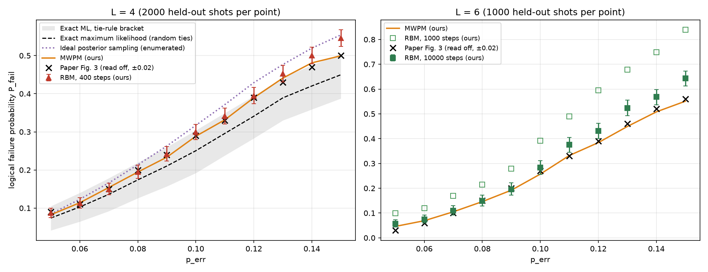
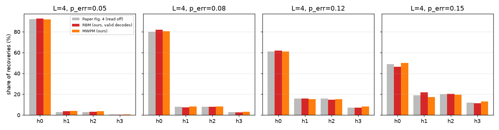
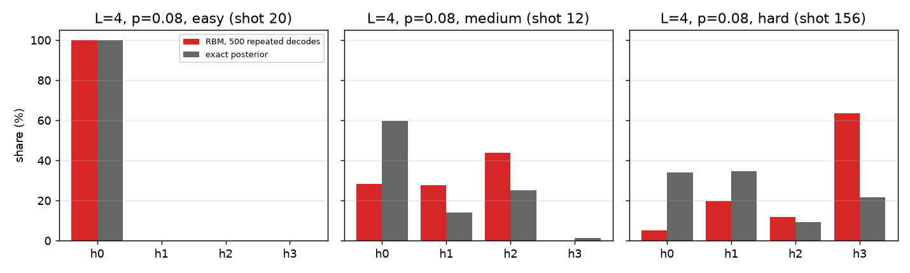

# Torlai & Melko (2017) RBM 神经解码器复现报告

> 论文：G. Torlai and R. G. Melko, “Neural Decoder for Topological Codes,” *Phys. Rev. Lett.* **119**, 030501 (2017), [doi:10.1103/PhysRevLett.119.030501](https://doi.org/10.1103/PhysRevLett.119.030501)；训练方法另参见作者的[公开预印本附录](https://arxiv.org/html/1610.04238#S1)。
> 本报告是项目内的独立复现（project-local），不使用作者源码。结果数据与全部 run ID 见 [`assets/torlai_melko_2017/results_summary.json`](assets/torlai_melko_2017/results_summary.json)；实现与调用关系见 [论文复现设计](../../docs/PAPER_REPRODUCTION_DESIGN.md)。

## 结论摘要

- **实现了论文的解码流程，观察到图 3、图 4 的主要定性趋势。** L=4 在 p ≤ 0.13 的 9 个错误率上与论文图 3 读数最多相差约 0.023；低错误率下 RBM 与 MWPM 的观测失败率接近，高错误率下 RBM 较高。p=0.14、0.15 的 RBM 失败率比论文读数高约 0.03–0.05。图 4 的闭合链同调类直方图在 4 个错误率下也大体相近；这些是读图后的描述性比较。
- **L=6 的失败率受解码截止步数影响很大。** 论文的 `N_eq ∝ 10²` 指开始检查兼容链前的平衡步数，未给出截止上限。将本项目的上限由 1000 提高到 10000 步并复用模型后，p ≤ 0.09 的 RBM 与 MWPM 观测值相差 0.003–0.011；p ≥ 0.11 时 RBM 较高。上限在查看初次结果后调整，不能将重解码数值当作预先设定预算下的独立验证。
- **定量复现仍有限制。** 每个设置只训练一个随机种子；本项目采用自选超参数和验证 BCE 选模型，论文公开附录描述的是按参考集逻辑失败率选模型，具体最优参数未核得。
- **三个固定 syndrome 的重复解码显示后验偏差。** 对其中两个较难的 syndrome，成功解码后的同调类频率与精确后验差异明显；三个案例不足以说明偏差随难度变化的普遍规律。

结论的准确表述是：**实现了论文解码流程并观察到相近的主要定性趋势；尚未验证定量等效性、RBM 阈值或整体后验校准。**

## 1. 论文方法与本项目的实验设计

### 1.1 物理问题

论文研究二维 toric code 在**独立相位翻转噪声**下的解码：`L × L` 周期格点的每条边上有一个量子比特，共 `N = 2L²` 个；每个量子比特以概率 `p` 发生 Z 错误，一次**完美**的顶点稳定子测量给出 syndrome `S`。这是 code-capacity 模型，不涉及测量错误和量子线路。

解码器根据 `S` 给出恢复链 `r`，要求 `S(r) = S(e)`。恢复成功与否取决于闭合环 `e ⊕ r` 的同调类：属于平凡类 h₀ 时成功，属于三个非平凡类之一时发生逻辑错误。逻辑失败率 `P_fail` 就是非平凡同调的比例。

### 1.2 论文的解码方法

论文用受限玻尔兹曼机（RBM）学习错误链与 syndrome 的**联合分布** `p(e, S)`：可见层由 `e` 与 `S` 组成，隐层 `h` 与两者全连接，用对比散度（CD）近似训练目标的梯度，再以随机梯度下降优化。每个错误率 `p` 单独训练一个网络。[论文与训练附录](https://arxiv.org/html/1610.04238#S1)

解码时（论文 Algorithm 1），把 syndrome 单元固定为测得的 `S₀`，从随机状态出发交替采样 `h ~ p(h | e, S₀)` 与 `e ~ p(e | h)`。这是块 Gibbs 采样，一种马尔可夫链蒙特卡洛方法。RBM 的生成样本不保证满足物理奇偶约束 `S = He`；一旦出现满足 `S(e) = S₀` 的错误链，就把它作为恢复链。超过步数上限仍未找到，则判为失败。[论文解码方法](https://arxiv.org/html/1610.04238)

论文用 L = 4、6，`p = 0.05 … 0.15` 共 11 个错误率，与最小权重完美匹配（MWPM）比较（图 3），并给出误差链与恢复链组成的闭合链 `e ⊕ r` 的同调类分布（图 4）。[论文图 3 与图 4](https://arxiv.org/html/1610.04238)

### 1.3 论文给出的与未给出的信息

论文正文给出了模型结构、训练目标、解码算法、数据规模量级（`|D_p| ∝ 10⁵`）和平衡步数量级（`N_eq ∝ 10²`）。仓库中的论文 PDF 不含补充材料；作者的[公开预印本附录](https://arxiv.org/html/1610.04238#S1)说明了 CD、SGD、权重衰减、待搜索的超参数类别，以及按参考错误链集上的逻辑失败率选择网络，但未列出各错误率的最优参数数值和完整搜索结果。本项目表中的具体参数均为自行选定，不能视为论文原参数。

| 设置 | 论文 | 本项目 |
|---|---|---|
| 训练样本 | ∝ 10⁵ | 100,000（另有 10,000 条验证集） |
| 测试样本 | 未给出具体数 | 每点全新留出集：L=4 为 2000 条，L=6 为 1000 条 |
| 隐单元数 | grid search（补充材料） | L=4 为 64，L=6 为 256 |
| 训练 | CD、SGD、权重衰减；公开附录未给逐点参数值 | CD-1，SGD，学习率 0.05，weight decay 1e-4，batch 64，50 epoch；权重以正态分布初始化，论文公开附录描述为均匀分布 |
| 模型选择 | 公开附录说明：按参考错误链集上的逻辑失败率选择超参数组合；未说明逐 epoch 的 checkpoint 规则 | 未做逐点超参数搜索；每次训练选验证集一步重建 BCE 最低的 epoch |
| 解码 | 单链；平衡（equilibration）约 10² 步后开始检查兼容性；超过固定步数判为失败，该上限未给出数值 | 单链；预热 25 步后每步检查；截止上限 L=4 为 400，L=6 为 1000 与 10000 |
| MWPM 对照 | Blossom V | 精确位掩码动态规划；defect 数超过 18 时改用 PyMatching（同为最小权重完美匹配） |
| 统计 | 未给出误差 | Wilson 95% 置信区间 |

本项目额外加入了两个与模型无关的参照（本次仅对 L=4 计算）：枚举全部 2¹⁷ 条兼容链，得到每个 syndrome 下各同调类的精确后验概率，从而算出**精确最大似然解码**（取后验最大的类）与**理想后验采样**（按后验概率随机取类）的失败率。后者对应“严格按后验分布抽样”的解码规则。两者用精确整数比较权重，不依赖浮点求和顺序。

**精确最大似然必须声明平手规则。** toric code 的码距简并使平凡类与某个逻辑类的后验**严格相等**很常见：L=4 的 2000 条测试样本中，每个错误率有 127–235 条（6.4%–11.8%）出现这种平手。本报告主列采用**在并列的最可能类中均匀随机选取**，并同时给出两个端点——平手一律判给平凡类（乐观）与平手一律计为失败（悲观）。三种规则之间相差 0.06–0.12，大于本报告多数结论所依据的差值，因此该列不能脱离规则单独引用。

### 1.4 前置验证

正式实验前，检查 toric code 的实现与噪声模型：L = 2…6 上量子比特数、稳定子秩（`L² − 1`）、每个顶点接 4 条边、每条边接 2 个顶点、`syndrome(e) = H·e mod 2`、同调映射是线性的且 4 个同调类都可达；L = 3、4 通过穷举确认码距等于 L，L = 5、6 在 800 万条随机闭环中未发现低于 L 的非平凡逻辑算符（随机抽查本身不构成码距证明）；噪声的实测翻转率在 L=4、p=0.08 的数据集上为 0.0803（训练 10 万条 0.080335、验证 0.080628、测试 0.078797，目标 0.08）；该数据集 32 个比特两两之间的最大相关系数绝对值为 0.0085，未见明显的比特间相关性。

## 2. 训练与推理中遇到的问题及解决方法

### 2.1 实验本身的问题

**问题一：冒烟配置严重欠拟合。**
最早的冒烟 run 使用 256 个训练样本、16 个隐单元、8 个 epoch，总共只有 32 次梯度更新。结果 24 条测试样本全部超时，一次也没有解出。训练与验证 BCE 接近（0.435 / 0.433），两者都**劣于**“按每个比特的训练集频率预测”的简单基线（0.377），且损失在最后一个 epoch 仍在下降。这些现象与训练不足相符；仅凭两组 BCE 不能排除其他原因或判断是否过拟合。

为检查隐单元数的影响，用 10⁵ 样本、50 epoch 分别训练 16、64、256 个隐单元：验证 BCE 从 0.121 降到 0.0018，单链解码的平凡类比例却都在 78%–80%，接近论文图 4 在相应设置下约 80% 的读数；更多隐单元时，96 次单链解码中的有效次数由 85 升到 93–95。正式实验据此采用 10⁵ 样本、50 epoch。冒烟 run 与这组实验同时改变了样本数和 epoch，不能据此断定训练量与模型容量各自的因果贡献。

另一个诊断现象值得记录：L=4 时，即使用**未训练**的模型，256 条并行链也能在 92% 的样本上找到兼容链，与"盲目随机抽样"的理论命中率 95% 相近。也就是说，在 L=4 上"能找到兼容链"并不能证明模型学到了东西；同样的抽样预算下，L=6 靠盲抽成功的概率只有约 3×10⁻⁶，这条退路完全消失。

**问题二：L=6 的解码步数上限不够。**

先区分两个容易混淆的量：论文的 `N_eq ∝ 10²` 是**预热步数**，即开始检查兼容性之前先让链跑多久；本项目的 `max_steps` 是**截止上限**，即最多允许走多少步去碰到兼容链，预热固定为 25 步。论文正文没有给出上限的数值，并明确指出这个截断使算法的计算开销 ill-defined：上限总可以提高，用更多计算换取更好的精度。因此不存在一个"论文的上限"可供对照。

可比的是预热之后实际需要多少步才命中兼容链。下表统计成功解码的样本（步数含 25 步预热）：

| 配置 | 中位数 | p90 | p99 | 最大 | 超时 |
|---|---|---|---|---|---|
| L=4，上限 400，p=0.05 | 26 | 48 | 231 | 381 | 29 |
| L=4，上限 400，p=0.08 | 29 | 97 | 328 | 398 | 36 |
| L=4，上限 400，p=0.15 | 71 | 199 | 326 | 398 | 39 |
| L=6，上限 10000，p=0.05 | 30 | 307 | 4625 | 8464 | 25 |
| L=6，上限 10000，p=0.08 | 97 | 1126 | 6337 | 9006 | 13 |
| L=6，上限 10000，p=0.15 | 1297 | 4759 | 8624 | 9922 | 67 |

- **L=4 的典型步数是 26–71 步，与论文的 10² 同量级**；11 个错误率上，400 步上限对应的超时率为约 1.5%–3.3%。这些步数是本项目模型的命中时间，不能等同于论文预设的平衡步数。
- **尾部远长于中位数。** 如果固定一个 syndrome，且预热后每步独立地以同一概率 `q` 命中兼容链，等待时间才近似服从几何分布；其中位数约为 `0.7/q`、99 分位数约为 `4.6/q`。实际 Gibbs 步之间相关，不同 syndrome 的命中难度也不同。L=6、p=0.08 成功样本的总步数（含预热）中位数为 97 步、p99 为 6337 步，不能用单一固定 `q` 解释。
- **均匀盲抽与训练后采样必须区分。** L=4、6 的奇偶约束秩分别为 15、35；均匀抽取错误链时，命中固定有效 syndrome 的概率分别为 `2⁻¹⁵`、`2⁻³⁵`，相差 `2²⁰` 倍。对固定码距，每个有效 syndrome 的兼容链数相同，不因物理错误率 `p` 增大而变少。训练后 Gibbs 采样的命中率还取决于模型、目标 syndrome 与链的相关性，不能由约束数单独推算。
- 上限 1000 那一组的中位数是**截断后的偏低值**（难解样本都被记为超时），不能直接与 10000 步一组比较。

解决方法：**不重新训练**，复用各点训练好的模型，把上限提高到 10000 步重新解码。由于每条测试样本使用固定的独立随机种子，前 1000 步与原先完全相同，因此一次运行即可得到 1000 到 10000 步各档的结果；每个点都逐条核对了原来已解出的样本完全复现。

需要说明：论文对每个错误率单独做了超参数搜索，而本项目在同一码距内的各错误率共用一组训练超参数。更好的模型可能改变兼容链的命中时间，但本实验没有隔离模型质量对步数的影响，也无法与论文未公开的具体截止上限做逐点比较。

## 3. 实验结果

### 3.1 逻辑失败率（对应论文图 3）

下图左侧为 L=4，右侧为 L=6。叉号是从论文图 3 人工读出的近似值，估计读数误差约 ±0.02；论文图未提供可供本项目比较的逐点不确定度。L=4 的两条虚线是本项目枚举得到的模型无关参照，灰色带是精确最大似然在两种极端平手规则之间的范围（见 §1.3）——该带覆盖了大部分 RBM 数据点，因此不能只凭黑色虚线判断 RBM 与最优解码的距离。表中的 Wilson 95% 区间只针对单个 RBM 失败率，不能用“MWPM 点估计是否落入该区间”检验两种解码器的差异；同一测试集上的差异需做配对分析。

**L=4**（每点 2000 条测试样本，步数上限 400；失败率中超时算作失败）：

| p | RBM | 95% 区间 | MWPM | 精确最大似然 （随机平手） | 平手规则区间 | 理想后验采样 | 论文约 | 超时 |
|---|---|---|---|---|---|---|---|---|
| 0.05 | 0.087 | 0.075–0.100 | 0.083 | 0.074 | 0.042–0.105 | 0.085 | 0.09 | 29 |
| 0.06 | 0.113 | 0.100–0.128 | 0.114 | 0.103 | 0.065–0.140 | 0.123 | 0.11 | 33 |
| 0.07 | 0.150 | 0.135–0.166 | 0.154 | 0.136 | 0.092–0.179 | 0.166 | 0.15 | 31 |
| 0.08 | 0.195 | 0.178–0.213 | 0.195 | 0.174 | 0.126–0.220 | 0.214 | 0.20 | 36 |
| 0.09 | 0.242 | 0.224–0.261 | 0.234 | 0.210 | 0.157–0.260 | 0.263 | 0.24 | 39 |
| 0.10 | 0.300 | 0.280–0.320 | 0.289 | 0.250 | 0.192–0.304 | 0.317 | 0.29 | 37 |
| 0.11 | 0.341 | 0.321–0.362 | 0.332 | 0.296 | 0.238–0.350 | 0.372 | 0.33 | 55 |
| 0.12 | 0.395 | 0.374–0.417 | 0.390 | 0.341 | 0.283–0.394 | 0.429 | 0.39 | 48 |
| 0.13 | 0.453 | 0.431–0.475 | 0.441 | 0.389 | 0.330–0.443 | 0.477 | 0.43 | 56 |
| 0.14 | 0.500 | 0.478–0.522 | 0.481 | 0.420 | 0.359–0.475 | 0.520 | 0.47 | 65 |
| 0.15 | 0.546 | 0.524–0.568 | 0.500 | 0.450 | 0.388–0.505 | 0.554 | 0.50 | 39 |

- p ≤ 0.13 时与论文读数最多相差约 0.023；p=0.14、0.15 分别高出约 0.03 和 0.05。低错误率下 RBM 与 MWPM 的观测失败率接近，p=0.15 时 RBM 高 0.047；差异的统计检验需要利用逐条配对结果。高错误率的偏离可能与超参数、模型训练或截止上限有关，本实验未将这些因素分离。
- 按随机平手规则，除 p=0.05 外（RBM 0.087，理想后验采样 0.085），RBM 的观测失败率位于精确最大似然与理想后验采样之间。这说明本项目“取首条兼容链”的输出不是已验证的无偏后验样本；仅凭平均失败率无法断定其偏差方向来自链权重、停止规则还是模型误差。
- **这一排序依赖平手规则。** 若平手一律计为失败，p ≤ 0.11 的“精确最大似然”反而高于 RBM（例如 p=0.05 为 0.105 对 0.087），上述夹在中间的关系不再成立。因此本条只在声明的随机平手规则下有效，不能作为 RBM 接近最优解码的证据。
- 在随机平手规则下，与精确最大似然的观测差距为 1.0–9.6 个百分点，总体随错误率增大（p=0.06 与 p=0.11 处略有回落）。即使严格按真实后验随机选取一个类，也通常不如选后验概率最大的类；但本项目的实际差距还可能包含模型误差、停止规则和超时的影响，不能全部归因于单次采样。论文讨论的多链同调类投票是潜在改进方向，并未在本实验中验证。[论文讨论](https://arxiv.org/html/1610.04238)

**L=6**（每点 1000 条测试样本；每个有效 syndrome 对应 `2³⁷` 条兼容链，本项目未枚举精确后验）：

| p | RBM（1000 步） | RBM（10000 步） | 95% 区间 | 有效率（10000 步） | MWPM | 论文约 | PyMatching 替补条数 |
|---|---|---|---|---|---|---|---|
| 0.05 | 0.099 | 0.057 | 0.044–0.073 | 97.5% | 0.046 | 0.03 | 0 |
| 0.06 | 0.119 | 0.074 | 0.059–0.092 | 97.2% | 0.069 | 0.06 | 0 |
| 0.07 | 0.169 | 0.109 | 0.091–0.130 | 97.9% | 0.105 | 0.10 | 0 |
| 0.08 | 0.214 | 0.149 | 0.128–0.172 | 98.7% | 0.146 | 0.15 | 0 |
| 0.09 | 0.279 | 0.196 | 0.173–0.222 | 98.9% | 0.192 | 0.20 | 0 |
| 0.10 | 0.391 | 0.283 | 0.256–0.312 | 98.3% | 0.257 | 0.27 | 2 |
| 0.11 | 0.489 | 0.375 | 0.346–0.405 | 98.8% | 0.332 | 0.33 | 6 |
| 0.12 | 0.595 | 0.431 | 0.401–0.462 | 98.4% | 0.384 | 0.39 | 13 |
| 0.13 | 0.678 | 0.524 | 0.493–0.555 | 97.6% | 0.449 | 0.46 | 15 |
| 0.14 | 0.749 | 0.568 | 0.537–0.598 | 95.4% | 0.508 | 0.52 | 26 |
| 0.15 | 0.839 | 0.643 | 0.613–0.672 | 93.3% | 0.551 | 0.56 | 45 |

- 10000 步时，p ≤ 0.09 的 RBM 与 MWPM 观测值相差 0.003–0.011；p ≥ 0.11 时 RBM 高约 0.04–0.09。这是点估计的描述，未预设等效界值，也未对各错误率的配对差异进行统一检验。
- L=4 与 L=6 的 RBM 曲线在 p=0.10–0.11 之间交叉。论文引用的约 10.9% 是既有文献中的阈值，并明确指出还需更大码距的有限尺寸分析才能估计**神经解码器自身**的阈值；本项目的两条有限尺寸曲线也不能提供该阈值。[论文讨论](https://arxiv.org/html/1610.04238)
- p=0.05 时 RBM 与 MWPM 都比论文读数（约 0.03）略高，这个点的读图误差相对较大。

**事后配对核对。** 对三个代表性点，从保存的逐条 RBM 预测与同一测试集重新计算 MWPM 逻辑失败标记；`n₁₀` 表示仅 RBM 失败，`n₀₁` 表示仅 MWPM 失败。下表的双侧精确 McNemar `p` 值按不一致样本的二项分布计算，供检验上述点估计的解释：

| 设置 | 测试样本 | n₁₀ | n₀₁ | RBM − MWPM 失败率 | 双侧精确 p |
|---|---:|---:|---:|---:|---:|
| L=4，p=0.15 | 2000 | 353 | 260 | +0.0465 | 0.00020 |
| L=6，p=0.09，10000 步 | 1000 | 73 | 69 | +0.0040 | 0.80 |
| L=6，p=0.11，10000 步 | 1000 | 136 | 93 | +0.0430 | 0.0054 |

这三个点是在查看数据后选取，检验结果未做多重比较校正，也未包含训练种子之间的波动，不能代表全部 22 个设置的整体推断。`p=0.09` 的非显著差异不能证明等效；正式比较需要预设等效界值、步数预算及多种子方案。复核输入为各 run 的 `predictions/toric_rbm_eval.npz`，MWPM 使用 [`mwpm_reference_recoveries`](../../ai_qec/benchmarks/decoding/toric.py) 在相同 syndrome 上重算；run ID 见 [`results_summary.json`](assets/torlai_melko_2017/results_summary.json)。

失败率随步数上限的变化如下。大部分点在约 5000 步后趋于平缓；p=0.14、0.15 到 10000 步仍有 5%–7% 的样本超时，这两点的 RBM 失败率可能仍略偏高。

### 3.2 同调类分布（对应论文图 4）

论文图 4 给出逻辑残余闭合链 `e ⊕ r` 在四个同调类上的比例，而不是单独的恢复链 `r` 的同调类（图中未标明码距，本报告按与图 3 数值的一致性推断为 L=4）。下图灰色为论文读数，红色为本项目 RBM（仅在成功找到兼容恢复链的样本上归一化），橙色为 MWPM（全部样本）。四个错误率下的图形大体相近；p=0.15 时 RBM 的平凡类比例（约 46%）比论文读数（约 49%）低约 3 个百分点。论文图 4 未说明超时样本的直方图分母，因此这里只作定性比较。[论文图 4 与正文](https://arxiv.org/html/1610.04238)

### 3.3 采样分布与精确后验的比较

为探索“重复解码的结果是否服从后验分布”，在 L=4、p=0.08 的模型上，对三个 syndrome 各用 500 个不同随机种子重复解码，并与枚举得到的精确后验比较。下列 RBM 同调类百分比以**成功解码次数**为分母，超时率另报：

- 平凡类后验为 99.9% 的简单 syndrome，500 次全部解到平凡类，步数中位数 26（预热 25 步后立即找到）。
- 后验为 59.8% / 13.9% / 25.2% / 1.2% 的中等 syndrome，RBM 给出 28.4% / 27.7% / 43.7% / 0.2%，3.4% 超时。
- 后验为 34.1% / 34.8% / 9.3% / 21.7% 的困难 syndrome，RBM 给出 5.0% / 19.7% / 11.7% / 63.6%，20% 超时。

这三个案例中，单次解码结果具有随机性；中等和困难 syndrome 上的成功解码同调类频率与真实后验差异明显。偏差可能来自模型、采样尚未充分平衡或“取首条兼容链”的停止规则，本实验无法区分。平均失败率与论文曲线接近，也不能据此推断每个 syndrome 都得到准确后验。多链投票能否逼近最大似然还取决于所得分布的质量，而不只是采样次数。本实验只选了三个 syndrome；对 400–500 次试验，单个类别的 Wilson 95% 区间半宽随比例而变，在占比约 5%–64% 的类别中约为 2–5 个百分点，并非统一的 ±2 个百分点，且不包含训练随机性的波动。

### 3.4 计算成本

训练在一个 GPU（RTX 4060 Laptop）上进行。解码是逐样本、逐步的迭代采样，成本随码距和错误率迅速上升：

| 设置 | 每点训练 | 每点解码 | 每条样本解码 |
|---|---|---|---|
| L=4，400 步，2000 条 | 9–12 分钟 | 1.8–6.9 分钟 | 72–208 ms |
| L=6，1000 步，1000 条 | 5–8 分钟 | 2.7–17 分钟 | 0.16–1.0 s |
| L=6，10000 步，1000 条 | —（复用模型） | 8.6–44 分钟 | 0.5–2.6 s |

解码耗时取自各 run `predictions/toric_rbm_eval.npz` 中的逐条 `decoder_latency_ms`，训练耗时取自 `training_summary.json`。MWPM 对照解码器没有计时，本报告不给出它的逐条耗时。L=6 的耗时是在三个进程同时占用 GPU 时测得的；并发也可能影响配置之间的耗时比例，因此这些数字只说明本机当时的计算成本，不是隔离资源后的速度基准。L=6、p=0.15、10000 步时，测得解码耗时约为训练的 9 倍，少数难以找到兼容链的样本占了大部分时间。

## 4. 局限性

1. **单一训练随机种子。** 置信区间只包含测试抽样误差，不包含训练本身的波动。
2. **L=6 的步数上限是看到结果后调整的。** 报告完整给出了 1000 到 10000 步的曲线，但作为正式数值，最好事先确定上限并在新的测试集上验证。
3. **超参数与模型选择不同于论文。** 公开预印本附录可获取，但未列逐点最优参数；本项目在同一码距内的各错误率共用训练超参数，按验证 BCE 选择每次训练的 checkpoint，而论文按参考集逻辑失败率选择超参数组合。22 个点的最低验证 BCE 都出现在最后一个 epoch（第 50 个）；这不能单独证明逻辑失败率是否收敛，也不能排除继续训练的收益。[论文训练附录](https://arxiv.org/html/1610.04238#S1)
4. **论文数值来自人工读图**，估计读数误差约 ±0.02，未做重复数字化；图 4 的码距是推断的。单项 Wilson 区间及其与 MWPM 点估计的相对位置不能证明差异显著或两者等效。
5. **MWPM 的平手处理会影响基线本身。** 多个等权最优匹配时，精确实现与 PyMatching 可能选择不同的同调类。在 L=6 的 11 个测试集上逐条比较（仅限 defect 数不超过 18、两种实现都能处理的样本，见下表），两者的匹配权重始终相同，但恢复链完全相同的比例只有 69%（p=0.05）降到 16%（p=0.15），同调类一致率由 96.0% 降到 62.4%，成败结论一致率由 96.2% 降到 74.7%，`P_fail` 相差 0.001–0.021。也就是说，**L=6 的 MWPM 基线在高错误率下自带约 0.02 的实现相关不确定度**，读表时应与「p ≥ 0.11 时 RBM 比 MWPM 高约 0.04–0.09」并列考虑；该差距仍大于这一不确定度，但余量比单看点估计时小。

   | p | 可比样本 | 恢复链全等 | 同调类一致 | 成败一致 | 精确 DP `P_fail` | PyMatching `P_fail` | 差 |
   |---|---:|---:|---:|---:|---:|---:|---:|
   | 0.05 | 1000 | 69.2% | 96.0% | 96.2% | 0.046 | 0.040 | 0.006 |
   | 0.08 | 1000 | 44.5% | 86.9% | 88.8% | 0.146 | 0.138 | 0.008 |
   | 0.11 | 994 | 28.1% | 75.1% | 81.3% | 0.330 | 0.320 | 0.010 |
   | 0.15 | 955 | 15.6% | 62.4% | 74.7% | 0.541 | 0.520 | 0.021 |

   完整 11 个点见 [`results_summary.json`](assets/torlai_melko_2017/results_summary.json) 的 `mwpm_tie_sensitivity_L6`，由 [`mwpm_tie_sensitivity`](../../ai_qec/benchmarks/decoding/toric.py) 计算。§3.1 的 L=6 表中，defect 数超过 18 的样本本就由 PyMatching 解码（p=0.15 时 45 条），因此该表的 MWPM 列混用了两种实现。
6. **阶段产物哈希问题（P0.19）** 尚未修复。对本报告引用的 33 个 run 逐一复核，全部都存在 `evaluate` 阶段登记的 `metrics.json` 哈希与磁盘文件不符：后续 `benchmark` 阶段又写入了该文件。因此，run 的 `success` 状态目前不能证明各阶段产物哈希完整；本次逐点核对的 RBM/MWPM 失败率仍与各 run 的 `benchmark_report.json` 一致。所有 run 都在有未提交改动的工作区中运行，代码状态由各 run 保存的 `git_diff.patch`（含未跟踪文件）记录；已抽查 Notebook 复用验证 run 的 patch，还原结果与提交 `5ec96a8` 的代码完全相同。
7. **部分分析的复算入口仍不完整。** 精确后验枚举与 L=6 的 MWPM 平手敏感度现在可由 [`scripts/torlai_melko_references.py`](../../scripts/torlai_melko_references.py) 从各 run 保存的逐条预测重算（实现见 [`exact_posterior.py`](../../ai_qec/benchmarks/decoding/exact_posterior.py)）。但 §2.1 的隐单元对比实验、§3.3 三个 syndrome 的 500 次重复采样，以及论文图像读数的逐次结果仍未随本报告归档，只能核对汇总数值，不能仅凭仓库内容独立重建。
8. 本实验未比较其他神经解码器，也未证明当前 RBM 在速度或准确率上具有竞争优势；其项目价值主要在于验证论文方法、建立实验基础设施和积累经验。

## 5. 复现方式与数据位置

- **数据与结果**：每个点都是 `runs/` 下独立的 run，包含配置快照、数据集引用、checkpoint、逐样本预测和 benchmark 报告；run ID 列在 [`results_summary.json`](assets/torlai_melko_2017/results_summary.json) 中。`runs/` 与 `datasets/` 不纳入版本控制。
- **单点实验**：[`paper/srcs/torlai_melko_2017.ipynb`](../srcs/torlai_melko_2017.ipynb) 可完整执行一个点；把 `REUSE_CHECKPOINT_FROM_RUN` 设为已有 run 的目录名，即可跳过训练、用不同步数上限重新解码。
- **批量网格与重解码**：由仓库外的调度脚本完成，脚本本身已作为 `runner.py` 复制进每个 run 的目录；它们调用的训练、解码、对照函数与 Notebook 完全相同。
- **模型无关参照的复算**：`python scripts/torlai_melko_references.py --project-root .` 读取各 run 保存的逐条预测，重算 L=4 的精确最大似然与理想后验采样失败率、以及 L=6 的 MWPM 平手敏感度，并写回 `results_summary.json`。枚举与平手规则在 [`ai_qec/benchmarks/decoding/exact_posterior.py`](../../ai_qec/benchmarks/decoding/exact_posterior.py)。
- **代码版本**：全部 33 个 run 的 `run_manifest.json` 记录的都是提交 `5e1729f` 加**未提交改动**（`dirty: true`），没有 run 运行在后续的 `69816b8` 或 `5ec96a8` 上。确切代码状态由各 run 自带的 `git_diff.patch`（含未跟踪文件）给出，L=4 网格与 L=6 网格使用的是两份不同的 patch（`diff_sha256` 分别以 `eae70c47`、`0711c330` 开头）——L=6 的那份包含了后来并入 `5ec96a8` 的复用模式、MWPM 替补与训练提速。已抽查 Notebook 复用验证 run 的 patch，还原结果与 `5ec96a8` 的代码完全相同；L=4 网格那份 patch 未做同等核对。

## 附录：主要数值来源

- 欠拟合诊断：冒烟 run（256 样本、8 epoch）；隐单元对比实验（10⁵ 样本、50 epoch，隐单元 16/64/256，项目内探索性实验，未写入 `runs/`）。
- 训练与未训练模型的配对比较（256 链，同一批 24 条样本、6 组种子）：成功率差为 +0.257，95% 区间 0.132–0.382。
- 模型无关参照：L=4 每点 2000 条测试样本，逐条枚举 2¹⁷ 条兼容链，权重以精确整数比较；平手规则见 §1.3。由 `scripts/torlai_melko_references.py` 生成，逐点数值（含三种平手规则与平手条数）见 `results_summary.json` 的 `exact_ml_p_fail_tie_rules` 与 `exact_ml_tie_shots`。
- MWPM 平手敏感度：L=6 的 11 个测试集，逐条比较精确位掩码 DP 与 PyMatching，仅统计 defect 数不超过 18 的样本；见 `results_summary.json` 的 `mwpm_tie_sensitivity_L6`。
